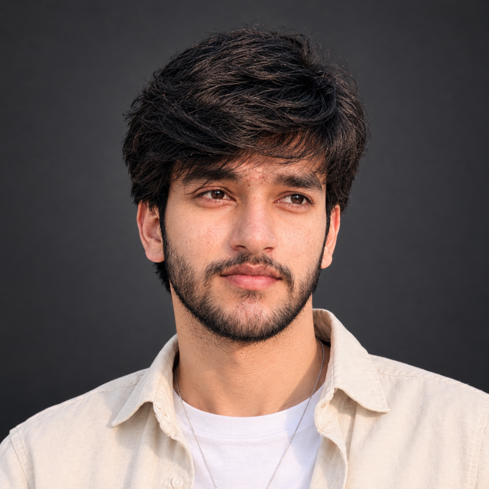

  

<h1 align="center">Hi 👋, I'm Abdul Rehman</h1>

<h3 align="center">Software Engineering Student | Aspiring Full-Stack Developer</h3>

  Passionate about software development, problem-solving, and building meaningful projects.

  

---

### 👨‍💻 About Me

* 🎓 Studying **Software Engineering at GCUF**
* 💻 Learning and practicing **Data Structures & Algorithms (DSA)** and **Object-Oriented Programming (OOP)**
* 🌱 Currently learning **MERN Stack Development**
* 🐍 Programming knowledge: **C++ and Python**
* 🌐 Web development foundations: **HTML and CSS**
* 🤖 Interested in **Artificial Intelligence, Machine Learning, and Automation**
* 🔐 Exploring **Cybersecurity and secure software development**
* 📚 Completed a course at **SMIT**
* 🚀 Building projects to develop practical skills

---

### 🛠️ Technologies & Tools

  

**Currently learning:** JavaScript, React, Node.js, Express.js, and MongoDB.

**Areas of interest:** AI, Machine Learning, Cybersecurity, and Automation.

---

### 📚 Core Concepts

* Data Structures & Algorithms
* Object-Oriented Programming
* Programming Fundamentals
* Web Development Fundamentals

---

### 🎯 Current Goals

* Build practical projects using the MERN stack.
* Improve problem-solving and algorithmic thinking.
* Explore Python-based AI and machine learning projects.
* Learn cybersecurity fundamentals and secure coding practices.
* Contribute to open-source projects and collaborate with other developers.

---

### 📊 GitHub Statistics

  

  

---

### 🤝 Let's Connect

I'm always interested in learning new technologies, exploring interesting projects, and connecting with fellow developers.

  <i>Learn continuously. Build consistently. Improve every day.</i>

